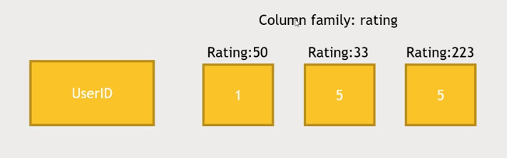
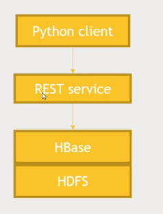

# Using non-relational data stores with Hadoop

## Activity: Import movie ratings into HBase (creating a HBase table with Python via REST)

### What are we doing?

- Create a HBase table for movie ratings by user
- Then show we can quickly query it for individual users
- Good example of sparse data

- We have a column family for ratings, where each column is a rating for each movie rated by the user

### How are we doing it?

|Image | Description |
|:-----|-------------|
| | <ul><li>Python client (being run on desktop instead of on Hadoop VMs -- like everything below</li><li>Runs a REST service on top of HBase (service that you can query through HTTP requests</li><li>HBase itself resides on top of the HDFS</li><li>The HDFS filesystem, being where the actual data is stored</li></ul>|

#TODO: Finish!