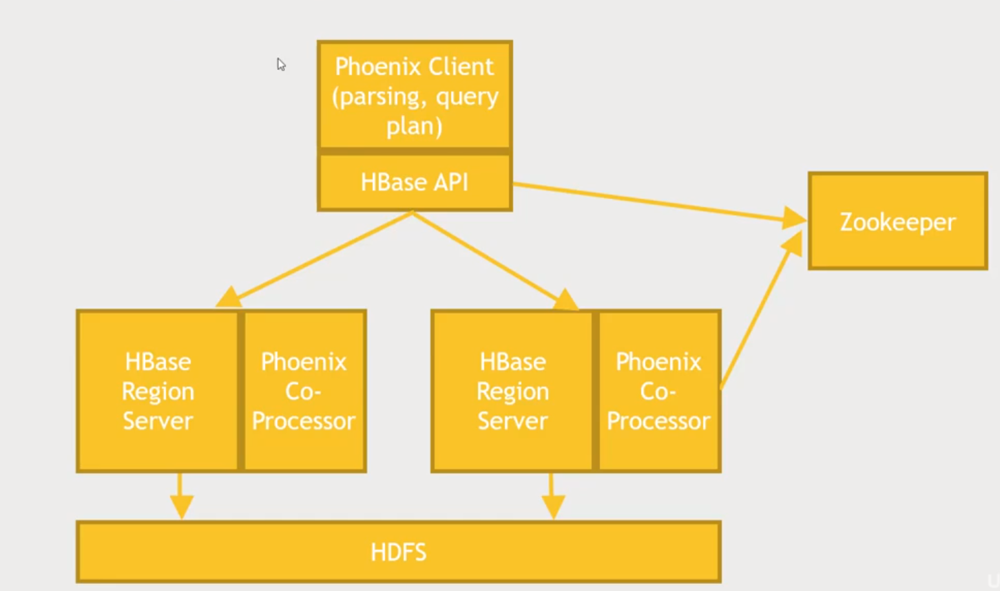

# Section 07: Querying your data interactively

## Apache Phoenix Overview - SQL for HBase

- Apache Phoenix is conceptually similar to Apache Drill in that it offers a SQL interface on top of a non-relational database
- The main difference, however is that it **only** works with HBase

### What is Phoenix?

- A SQL driver for HBase that supports transactions
  - Reminder: HBase is a (columnar) NoSQL database that sits ontop of HDFS
  - Phoenix suppors transactions by allowing users to combine different SQL queries together and commit them all at once
    - This way you can actually have a more complex transaction that gets executed *atomically*, meaning that if some other client is trying to get a response back on what you're trying to change, it won't get some intermediate result as part of that - this might be important for some users
- Fast, low-latency - OLTP support
  - Can be appropriate for OLTP applications, online transaction processing in addition to analytic queries
  - This means that if you have a wide-scale, big web application that needs to execute very large transaction rates and get answers back very quickly, Phoenix can actually meet those requirements, *assuming your queries are simple enough*
    - Again, as it is operating on a NoSQL (non-relational) db, performing a series of large and complex joins can be like getting blood from a stone
    - However, if the data is indexed and queries are made on indexed data, then Phoenix can be very fast, *in some cases **even faster*** than using native HBase connectors
- Originally developed by Salesforce, then open-sources with an Apache license
- Works by exposing a JDBC (a db driver for Java applications) connector for HBase
  - This means that if you have an application or client that can already talk to a JDBC interface, you know, such as many existing applications or things like Tableau, you can just use Phoenix and potentially connect it directly to HBase without a lot of work
- Supports secondary indices (on HBase db) and user-defined functions
- Integrates with MapReduce, Spark, Hive, Pig and Flume

### Why Phoenix?

- It's really fast. You probably won't pay a performance cost from having this extra layer on top of HBase
- Why Phoenix and not Drill?
  - Choose which is right for the job - Phoenix is dedicated solely to HBase
- Why Phoenix and not HBase's native clients?
  - *Your apps, and analysts, may find SQL easier to work with*
  - *Phoenix can do the work of optimising more complex queries for you*
    - But remember that HBase is still fundamentally non-relational

### Phoenix architecture

#### How does Phoenix work?

- Most of the architecture shown above is the HBase architecture, where you have a HBase client which might be an application or a JDBC database driver for Phoenix and that talks to various HBase region servers (how the data is partitioned !check_this), which in turn sit on top of your HDFS cluster to store and retrieve its data
- Ideally you want HBase region servers to be aligned with HDFS servers to minimise network traffic
- This is where Phoenix comes in, it has a Phoenix client that sits on top of the HBase API in your client side or within the database driver, and on the server side, there is a Phoenix co-processor that installs itself into HBase to support what Phoenix wants to do
- In summary, Phoenix attaches itself to both the client and server side for HBase and both use Zookeeper to keep track of what region servers are actually available

### Using Phoenix

Ways to use Pheonix include:

- Command-Line Interface (CLI)
- Phoenix API for Java
- JDBC Driver (thick client = logic for talking to client exists on the client side ???, but offers a simple interface)
- Phoenix Query Server (PQS) (thin client)
  - *Intended to eventually enable non-JVM access*
  - This allows you to split out the heavyweight parts of the JDBC driver into its own server which allows you to then scale that piece out independently if you want to
  - This means you could potentially have a separate fleet of Phoenix query servers doing all of the hard work of the Phoenix client and then have a thinner client on your actual application that talks to that fleet of query servers
  - This is useful in some architectures and it's ultimate goal is to enable a way for non-Java based applications to talk to Phoenix directly
- JAR's for MapReduce, Hive, Pig, Flume, Spark

### Let's Play

- Install Phoenix on our Hortonworks Sandbox
- Mess around with the CLI
- Set up a users table for MovieLens
- Store and load data to it through Pig integration