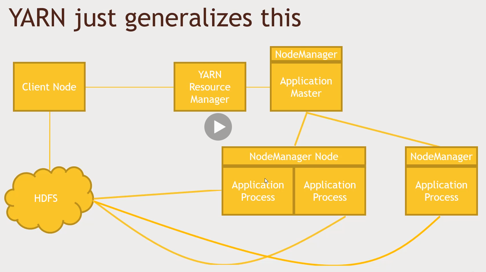

# YARN Explained (Yet Another Resource Manager)

## What is YARN

- Yet Another Resource Negotiator
  - Introduced in Hadoop 2
  - Separates the problem of managing resources on your cluster from MapReduce
  - Enabled development of MapReduce alternatives (Spark, Tez) built on top of YARN

- It's just there, under the hood, managing the usage of your cluster
  > I can't think of a reason why you'd need to actually write code against it yourself in this day and age. But you can.

## Where YARN fits in

Where does YARN fit in architecturally?

- At the bottom of the stack is HDFS (Hadoop Distributed File System), which is the cluster **storage layer** - this allows us to spread out the storage of big data, by breaking it up into blocks that are replicated across various nodes in the cluster
- YARN sits on top of the storage layer and is the **compute layer** for your cluster and it can execute specific jobs, tasks or application chunks.
  - YARN splits up the *computation* (computing resources) across the cluster, whereas Hadoop splits up the *storage* (storage resources) across your clusters
  - These two components are actually pretty tightly integrated, because YARN tries to maintain data locality. If you try to execute a job that is specifically looking to operate in some specific blocks of data in HDFS, YARN will try to align those on the same physical host as much as possible
- On top of YARN we can write applications such as MapReduce, Spark and Tez.
  - These are YARN applications that sit on top of the compute layer which in turn sits on top of the storage layer

## Recall how MapReduce works

- This is the original slide from the earlier MapReduce section of the course
- The slide shows a specific example of how YARN works:
  - The **Client Node** has a MapReduce script that talks to the HDFS cluster directly in some cases and kicks off a request to the **YARN resource manager** to spin up a MapReduce application
  - **YARN** requests a **NodeManager** running on a specific node somewhere that has the capacity to do so, and runs the MapReduce application master, which in turn would ask for more resources through **YARN**
  - **YARN** would get the extra resources needed from the **NodeManager Node**, (a physical computer that might be running a couple of different MapReduce tasks) combined with a possible other computer also running its own **NodeManager** and has just a single task going on
  - Each node can then potentially have multiple containers running different processes and these all are communicating to each other through HDFS to get the data that it needs.

## YARN just generalises this

- YARN generalises how MapReduce works by replacing all MapReduce processes with "application"
- This is because YARN is a general purpose framework for running applications: 
  - You kick off an application from your client
  - A YARN resource manager will then kick off an application master that runs on whatever node has capacity to run it
  - And then that application master is responsible for working with YARN to spin up more nodes that have their own NodeManagers that run specific application processes
- In summary:
  - YARN figures out where to run all the application processes, where to split up these nodes and how to evenly distribute the processing of that information across your cluster and do it in such a way that it minimises data getting shuffled around a network
  - YARN optimises the usage of your cluster from CPU cycles and also tries to maintain data locality to ensure that a specific application process has as quick as access as possible

## How YARN works

- Your application talks to the Resource Manager to distribute work to your cluster
  - Note that in a high availability Hadoop environment, there may be multiple resource managers that use ZooKeeper to keep track of who the main master is at any given point. A single resource manager doesn't have to mean a single point of failure
- You can specify data locality - which HDFS block(s) do you want to process?
  - *YARN will try to get  your process on the same node that has your HDFS blocks*
- You can specify different **scheduling options** for applications
  - *This means you can run more than one application at once on your cluster*
  - *FIFO (First-in, first-out), Capacity and Fair Schedulers*
    - **FIFO**: runs jobs in sequence, first in, first out
    - **Capacity**: may run jobs in parallel if there's enough spare capacity
    - **Fair**: may cut into a larger running job if you just want to squeeze in a smaller job

## Building new YARN applications

- Why? There are so many existing projects for most use-cases
  - DAG (directed acyclic graph) applications can be built on Spark or Tez
- However, if you need to build an application:
  There are frameworks such as Apache Slider and Apache Twill, that serve as higher level abstractions on top of YARN

