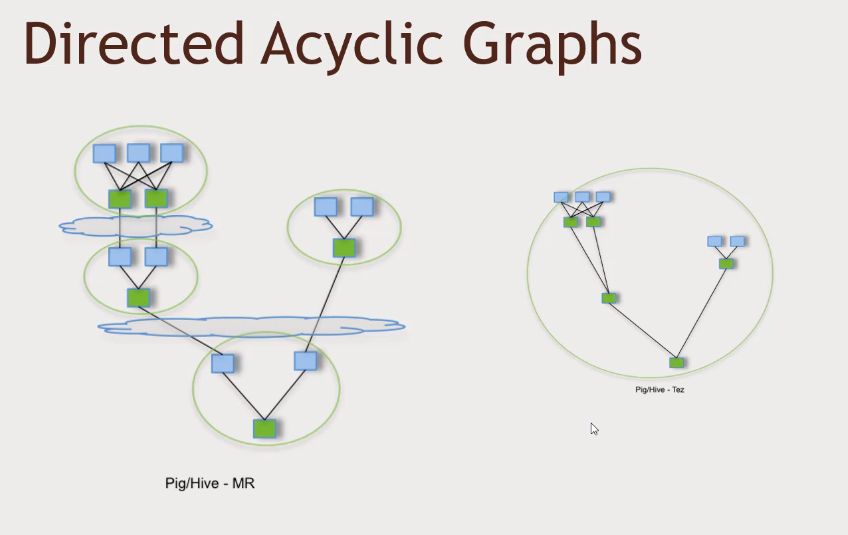
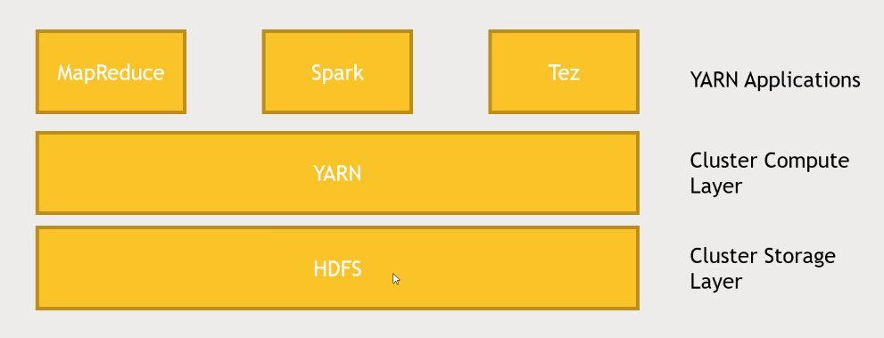
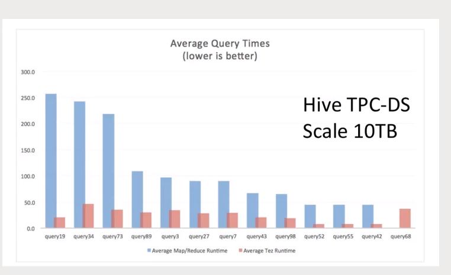

# Apache Tez - Directed Acyclic Graph Framework

## What is Tez?

- Another bit of infrastructure that is part of the Hadoop ecosystem that you can use
- Tez manages directed acyclic graphs (DAGs), similar to Spark. It is basically an alternative to MapReduce for higher level applications to run on top of
  - Tez makes Hive, Pig and MapReduce jobs faster
  - It's an applicationf framework that clients can code against as a replacement for MapReduce
- Tez constructs DAGs for more efficient processing of distributed jobs
  - It relies on a more holistic view of your job by eliminating unneccesary steps and dependencies
- Tez also optimises physical data flow and resource usage

## Tez can optimise MapReduce jobs

- The slide above shows a concrete example of how Tez works (from tez.apache.org):
  - The slides shows a case study of a Pig/Hive job that runs on MapReduce
  - The left part of the diagram shows various MapReduce stages (blue box = Mapper, green box = Reducer), which get iteratively combined together across HDFS (represented by the clouds) to a final Mapper and Reducer, which gives the final result
  - On the right, the diagram shows how Tez can take the multi-stage MapReduce processes and combine them more efficiently to run at the same time
  - Tez combines the four distinct MapReduce stages and runs them all together as one sequence of dependencies

## Where Tez sits

Where does Tez sit architecturally?

- To recall, YARN is the resource negiotiator which sits on top of HDFS which is the storage layer
- On top of YARN, various applications can be built such as MapReduce or Spark, or in this case, Tez
- Tez is at the same level as MapReduce and anything that sits on top of this layer like Hive or Pig can talk to MapReduce or Tez to get the results they want
- Spark is considered as it's own thing and is able to do everything that Pig and Hive can do

## Just tell Hive or Pig to use MapReduce/Tez

- As a user, the only requirement for using Hive or Pig is to ensure that they are using either MapReduce or Tez. However, many Hadoop platforms such as Hortonworks typically enable this by default
- Tez is **much faster** than MapReduce; the graph below shows in a comparison of query times between MapReduce and Tez, that Tez outperforms MapReduce for all queries run

