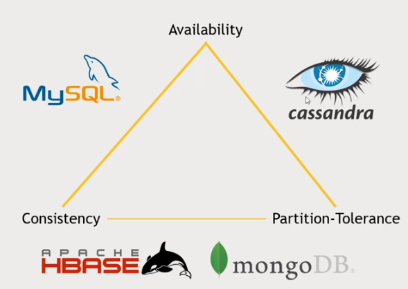
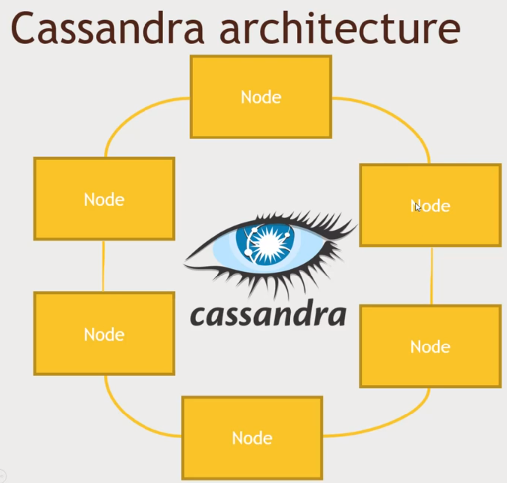
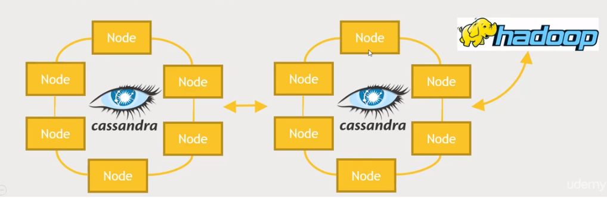

# Section 06: Using non-relational data stores with Hadoop

## Cassandra Overview - 'NoSQL with a twist'

> Cassandra is another distributed non-relational database system that's unique in that it has no single point of failure, i.e. there is no master node; it is engineered for (high) availability (above all else)

## Cassandra - a distributed database with no single point of failure

- Same underlying data model and data structure as BigTable or HBase, which we've talked about previously and is still a non-relational database (doesn't involve typical RDBMS operations like joins, normalising data structures, etc)
- Like HBase it is really tuned and optimised for transactional queries such as vending very large amounts of data at a very large, internet-size, global scale. I.e. it is engineered for **high availability**, **massive transaction rates** and **high scalability**
- Unlike HBase, there is no master node at all - every node runs exactly the same software and performs the same functions
- It's non-relational, but has a ***limited*** CQL query language as it's interface - at it's core it is just breaking things up by primary key values and distributing these across a cluster

## Cassandra's Design Choices :arrow_right: CAP theorem

- **CAP** stands for **C**onsistency, **A**vailability and **P**artition tolerance
- The **CAP theorem** says you can only have 2 out of the 3: consistency, availability and partition-tolerance
  - *And partition-tolerance is an essential requirement with "big data", so you really only get to choose between consistency and availability*
  - ***NB:** there are caveats to this, recent trends in technology are making (choosing all of CAP) more possible*
- Cassandra favours availability over consistency
  - *It is "eventually consistent" -- i.e. not **immediately** seen/updated*
  - *But you can specify you consistency requirements as part of your requests. So really it's "tuneable consistency"*
- Partition-tolerance means that the database can be easily split up and distributed across a cluster

## Where Cassandra fits in CAP tradeoffs

- Cassandra values availability and partition tolerance over consistency (AP)
- HBase values consistency and partition-tolerance over availability (CP)
  - Has a single master node for availability, and the master node does have replication but if master node goes down or if Zookeeper goes down then HBase is unusable (similar to MongoDb)
- MySQL values consistency and availability over partition-tolerance (CA)
  - MySQL (or other RDBMS') have consistency and availability but are challenging to distribute over a cluster

## Cassandra architecture

- Unlike HBase, Cassandra doesn't have any master nodes to keep track of what node serves what data
- Instead it uses what's called a 'gossip protocol', so that every node in your cluster is communicating with each other every second to keep track of who's responsible for what bits of data and where the data is replicated, etc
- Every node in a Cassandra cluster is runs the exact same software, does exactly the same thing and performs exactly the same functions
- So your client can talk to any of these nodes to find out where any part of the data lives and communicate data replication to make sure each node has a backup copy of the data (to whatever redundancy that is specified when setting up the cluster)

### Example scenario

- You have a client that wants to write some data and it will talk to a node that will respond by saying that this bit of data gets hashed to a certain value that maps to a given specific node and another node that it is going to back it up to, and maybe a third, etc

- The data is distributed across the ring of nodes such that the entire range of primary keys that can be written into a Cassandra database get hashed into these different ranges of values, where node 1 maybe contain the range [1 - 1000000], node 2 - [1000001 - 2000000], .. , etc.

- Nodes will talk to each other in a peer-to-peer style and figure out how to copy the data around, keep track of changes, keep track of which nodes are running (up) and which are down

- How to keep track of the fastest node to get a particular answer? The nodes will all talk to each other using gossip protocols and will use technologies such as a ***'snitch'*** to keep track of how to get things in the quickest way - *this is all managed internally*

- You can enforce consistency by specifying in a read request, how many nodes should agree on the same value (e.g. 2 out of 3 nodes). Alternatively, you can optimise only for speed and availability by accepting the value provided by the first node

## Cassandra and your cluster

- Cassandra can be good for fast access to rows of information
- It is possible to get the best of both worlds by replicating Cassandra to another ring that is used for analytics and Spark integration

- To do this, you would set up separate racks/data centres of Cassandra nodes, where Cassandra is aware of those and manage replication between them

- In this pattern, one ring (cluster) is responsible for handling online queries from a web site or web server (for all transactional queries being done by the system)

- This replicates to another Cassandra cluster (ring) that propagates the same data across and uses something like Zephyr analytics or integrates with the Hadoop cluster to operate Hive or Spark queries for analysing the data in a more batch-oriented analytics system

- The benefit of this system is that you can perform analytics on Cassandra data (analytics cluster) without impacting the transactional system that might be serving a web front end.

## CQL (Wait, I thought this was NoSQL!

- Cassandra's API is CQL (essentially /GETs and /PUTs), which makes it easy to look like existing database drivers to applications
- CQL is like SQL, but with some big limitations:
  - ***NO JOINS***
    - Data must be de-normalised
    - Still non-relational
  - ***All queries must be on some primary key***
    - Secondary indices are supported but not as performant as primary keys
- CQLSH can be used on the command line to create tables, etc..
- All tables must be in a ***keyspace*** - keyspaces are like databases (in Cassandra)

## Cassandra and Spark

- DataStax offers a Spark-Cassandra connector
- Allows you to read and write Cassandra tables as DataFrames
- Is smart about passing queries on those DataFrames down to the appropriate level
- Use cases:
  - *Use Spark for analytics on data stored in Cassandra*
  - *Use Spark to transform data adn stored it into Cassandra for transactional use*

**Caveat**: Cassandra is not the only NoSQL application that integrates with Spark, but there is a good amount of open source support