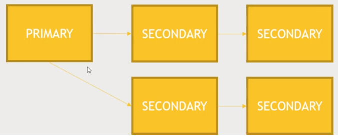
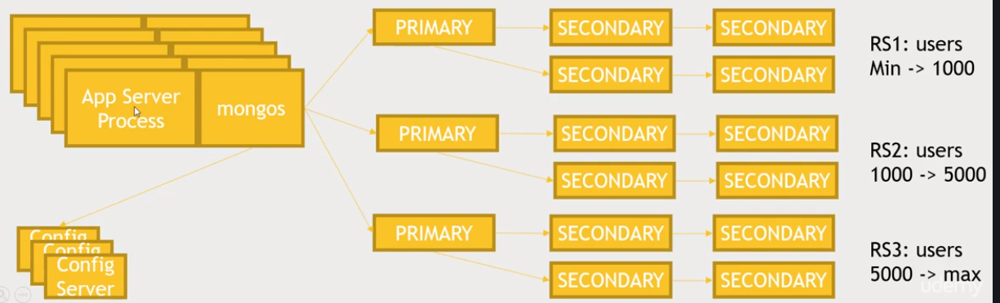

# Section 06: Using non-relational data stores with Hadoop

## MongoDB overview - Managing 'hu**MONGO**us' data

### Cap theorem

- MongoDB favours consistency and partition-tolerance in the CAP triangle
- This means that it can deal with big data (partition-tolerant) and favours consistency over availability
- MongoDB has a single master and a single primary database that you have to talk to all the time to ensure consistency
- But, if that master goes down, it will result in a period of unavailability, while a new primary database is put into place

## Document-based data model

- Has a nested JSON like struture
- E.g.:

    ```json
    {
        "_id": ObjectID("7b33e366ae32223aee34fd3"),
        "title": "A blog post about MongoDB",
        "contents": "This is a blog post about MongoDB",
        "comments": [
            {
                "name": "John",
                "email": john.doe@gmail.com,
                "content": "This is the best article ever written!",
                "rating": 1
            }
        ]
    }
    ```

## No real schema is enforced

- You can have different fields in every document (if you want to)
- No single "key" as in other databases
  - *But you can create indices on any fields you want, or even combinations of fields*
  - *If you want to "shard", then you must do so on some index*
- Results in a lot of flexibility
  - But with great power comes great responsibility
- With that said, you still need to think about what queries you are going to be performing on the database and design your database schema accordingly
- Make sure to think about what indices you might need for fast lookups for the queries as it is still a NoSQL database and you cannot do joins efficiently

## MongoDB terminology

- Database: contains ***collections***
- Collections: contain ***documents***
- Document: smallest unit of data

## Replication Sets

- MongoDB has a single master architecture
  - The idea being that we want to have consistency over availability
- But, you can have secondary databases that maintain copeis over time from your primary database
  - Those writes then get replicated through an operation log to any secondary nodes that you might have attached to it
- Maintains backup copies of you database instance
  - *Secondaries can elect a new primary within seconds if your primary goes down*
  - *But make sure your operation log is long enough to give you time to recover the primary when it comes back...*



- In the diagram we have a primary MongoDB server that your application talks to, and maybe some secondary backup nodes in one data centre and couple of secondary nodes in another
- MongoDB will automatically replicate those operations to those secondaries, so that in the event that the primary goes down, one of the secondaries can take its place
  - The replication chain works in an arbitrary way, it tries to figure out which server it can talk to most quickly (i.e. from the fastest ping times)
  - The good thing is that if the primary does go down, a new secondary can be elected and take place within seconds, resulting in little downtime in the event of a primary failure
    - But, you do need to make sure to get the primary back up online pretty quickly because if the operation log runs out of space during the time it's been down, recovering the primary becomes much more difficult
- NB: All the data sits in the Primary database (pictured above) and all the secondary databases are used for replication

## Replica Set Quirks

- A majority of the servers in your set must agree on the primary
  - This means even numbers of servers (like 2, 4, ...) don't work well
- Don't want to spend money on 3 servers? You can set up an 'arbiter' node
  - ***But only one***
- Apps must know about enough servers in the replica set to be able to reach one and learn which is the primary (i.e. the primary and >= 2 secondaries)
  - Becomes a hassle if changing or removing secondary servers, in this case, this configuration needs to be accessible to the application
- Replicas only address durability, not your ability to scale
  - ***Unless, you can take advantage of reading from secondaries -- which generally isn't recommended***
  - ***And your DB will still go into read-only mode for a bit while a new primary is elected***
- Delayed secondaries can be set up as insurance against people doing dumb things (time delay for the replication between you primary node and a specific secondary node)
  - E.g. Say a 1 hour delay is set, and data is accidentally deleted/removed/dropped, it is possible to shut things down and restore from the delayed secondary to get back to the beginning o the hour and restore lost data quickly

## Big Data - Sharding

- For scaling out data across more than one server (with MongoDB, we need to set up sharding)
- The way sharding works is that there a multiple replica sets, where each replica set is responsible for some range of values on some indexed value in my database
- In order to get sharding to work, it requires that you set up an index on some unique value on your collection and that index is used to actually balance the load of information among multiple replica sets
- Then, on each application server, or what's being used to talk to MongoDB, you'll run a process called "mongos" and "mongos" will talk to exactly three configuration servers that you have running somewhere, that knows how things are partitioned and uses that to figure out which replica set to talk to (to get the required information)

### Understanding sharding (multiple replica set) architecture



- We have many application servers, these might be web servers on a big web application, e.g. where each process of your web servers is running an instance of "mongo-s"
- Each "mongo-s" has some communication with 3 configuration servers you're running somewhere and these can run on top of other servers you might have, *they do not need to do a lot of work, but you **need** 3 of them*
- From there, it is possible to figure out which replica set to talk to, to actually read or write the information for a given user ID or something you're indexing on
- That replica set in turn can take care of durability and actually backing up the data

## TODO: FINISH (!!!) [Lecture 50]
